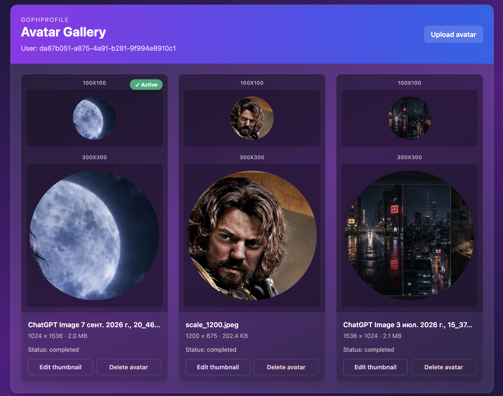
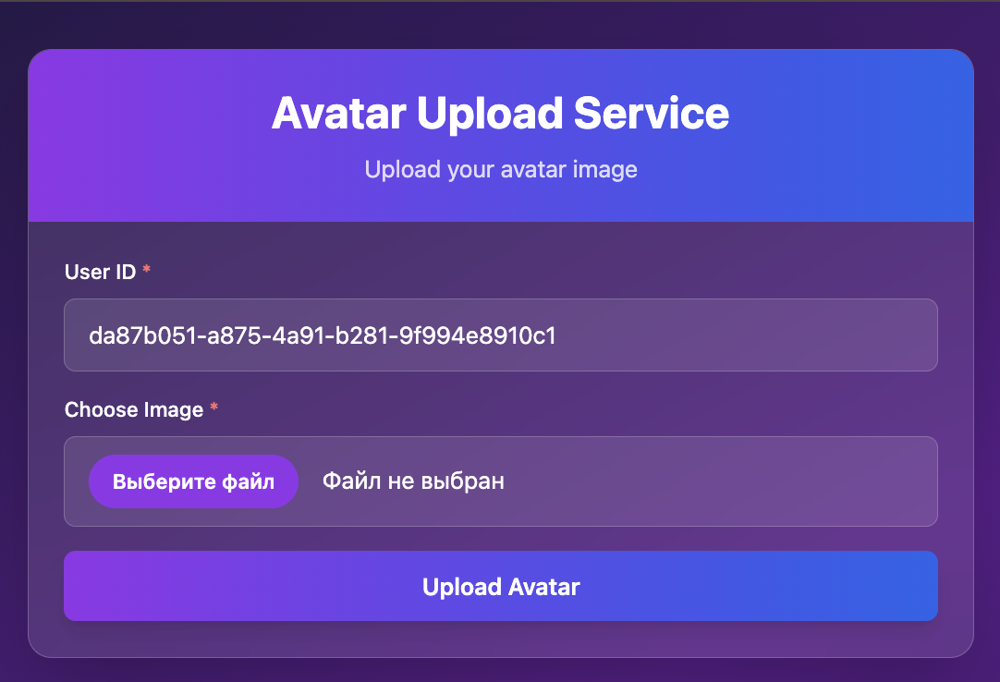
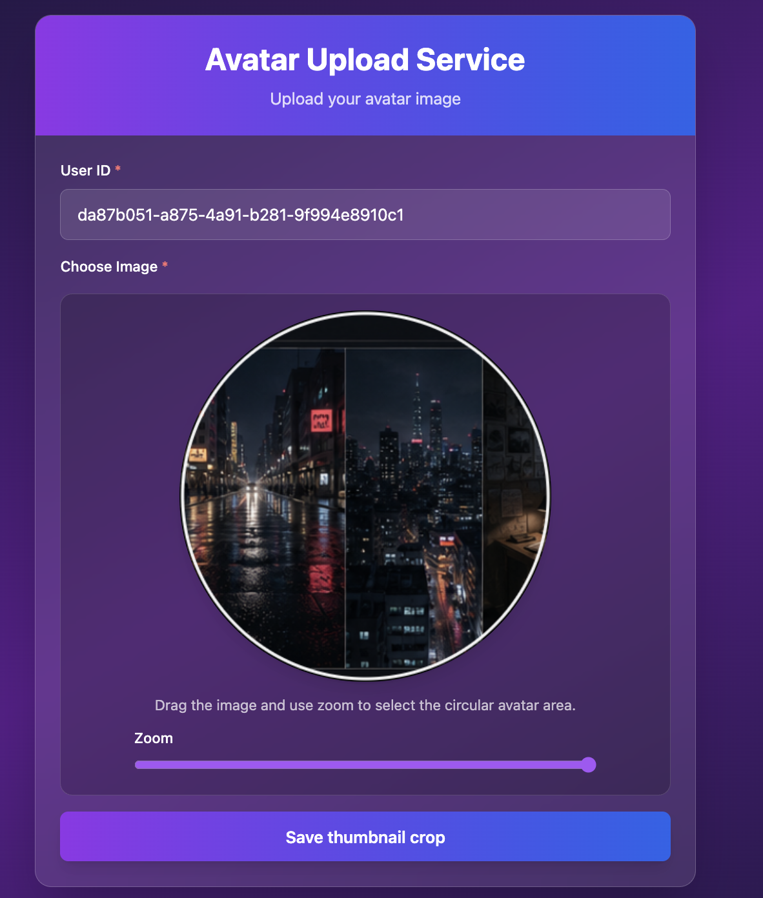

# GophProfile

GophProfile — сервис хранения и обработки аватаров на Go.

Стек: Echo, PostgreSQL, MinIO (S3), Kafka, OpenTelemetry, Prometheus/Grafana, Jaeger, Loki, Vault + External Secrets Operator, Kubernetes/Helm.

<p style="text-align:center">

</p>

---

## Быстрый старт (Docker Compose)

Поднять всю инфраструктуру локально:

```bash
task docker-up
```

После запуска:

| Сервис            | Адрес                          |
|-------------------|--------------------------------|
| API               | <http://localhost:8080>         |
| Swagger UI        | <http://localhost:8080/docs>    |
| Prometheus метрики| <http://localhost:8080/metrics> |
| MinIO Console     | <http://localhost:9001>         |
| Grafana           | <http://localhost:3000>         |
| Jaeger            | <http://localhost:16686>        |

Миграции выполняются отдельным `migrate` service до запуска `server`, `worker` и `cronjob`.

Все команды управления инфраструктурой — `task --list` или в [`tasks/Taskfile.docker.yaml`](tasks/Taskfile.docker.yaml).

---

## Локальный Kubernetes (k3d)

Порядок первого развёртывания:

```bash
task k3d-up           # кластер + Traefik + metrics-server
task harbor-up        # Harbor registry
task harbor-configure # создать project gophprofile и robot account (нужно один раз)
task secrets-up       # Vault + External Secrets Operator
task dependencies-up  # PostgreSQL, MinIO, Kafka, OTEL Collector
task monitoring-up    # kube-prometheus-stack
task observability-up # Loki + Jaeger (зависит от monitoring-up)
task otel-up          # OTEL Collector (зависит от monitoring-up)
task dev-deploy-local # собрать образы → Harbor → Helm deploy
task app-migration-status  # убедиться что миграции прошли
task admin-access-up  # Ingress BasicAuth для Prometheus/Grafana/Jaeger/Vault
```

### Сервисы и адреса

| Сервис | Адрес | Доступ |
|--------|-------|--------|
| GophProfile API | <http://gophprofile.localhost:8080> | Ingress (Traefik) |
| Swagger UI | <http://gophprofile.localhost:8080/docs> | Ingress (Traefik) |
| Prometheus | <http://prometheus.gophprofile.localhost:8080> | Ingress BasicAuth admin/admin |
| Grafana | <http://grafana.gophprofile.localhost:8080> | Ingress BasicAuth admin/local-change-me |
| Jaeger UI | <http://jaeger.gophprofile.localhost:8080> | Ingress BasicAuth admin/admin |
| Vault UI | <http://vault.gophprofile.localhost:8080> | Ingress BasicAuth, токен: `task secrets-vault-token` |
| Harbor UI | <http://localhost:30002> | NodePort |
| MinIO Console | `kubectl port-forward` → <http://localhost:9001> | minioadmin/minioadmin |
| PostgreSQL | `postgres.gophprofile-deps.svc.cluster.local:5432` | K8s DNS (internal) |
| MinIO API | `minio.gophprofile-deps.svc.cluster.local:9000` | K8s DNS (internal) |
| Kafka | `kafka.gophprofile-deps.svc.cluster.local:9092` | K8s DNS (internal) |
| OTEL Collector | `otel-collector.gophprofile-deps.svc.cluster.local:4317` | K8s DNS (internal) |
| Loki | `loki.gophprofile-deps.svc.cluster.local:3100` | K8s DNS (internal) |
| Pyroscope | `pyroscope.gophprofile-deps.svc.cluster.local:4040` | K8s DNS (internal) |

<details>
<summary>Port-forward команды (если Ingress недоступен)</summary>

```bash
kubectl port-forward -n monitoring svc/kube-prometheus-prometheus 9090:9090
kubectl port-forward -n monitoring svc/kube-prometheus-grafana 3000:80
kubectl port-forward -n gophprofile-deps svc/jaeger 16686:16686
kubectl port-forward -n vault svc/vault 8200:8200
kubectl port-forward -n gophprofile svc/gophprofile 8080:8080
kubectl port-forward -n gophprofile-deps svc/minio 9001:9001
kubectl port-forward -n gophprofile-deps svc/postgres 5432:5432
kubectl port-forward -n gophprofile-deps svc/kafka 9092:9092
```

</details>

### Pyroscope (опционально)

По умолчанию профилирование отключено. Включать только когда нужно отловить проблему производительности — требует 10Gi storage.

```bash
task pyroscope-up           # поднять сервер
task app-pyroscope-enable   # включить в приложении
# ...профилирование...
task app-pyroscope-disable  # отключить
task pyroscope-down         # удалить сервер
```

### Полезные команды отладки

```bash
kubectl get pods -A                                                        # статус всего кластера
kubectl get ingress -A                                                     # все ingress routes
kubectl logs -n gophprofile -l app.kubernetes.io/component=server -f      # логи server
task secrets-vault-token                                                   # Vault root token в буфер
task app-migration-status                                                  # статус миграций
```

Детальная архитектура кластера: [docs/architecture-k8s.md](docs/architecture-k8s.md).  
Фактическая проверка масштабируемости (HPA scale-out/in, load balancing, graceful shutdown): [docs/scalability-verification.md](docs/scalability-verification.md).

---

## API документация

Swagger UI доступен когда сервер запущен:

- Локально: <http://localhost:8080/docs>
- В k8s: <http://gophprofile.localhost:8080/docs>

Спецификации в репозитории:

- [`docs/swagger.json`](docs/swagger.json) — OpenAPI в JSON
- [`docs/swagger.yaml`](docs/swagger.yaml) — OpenAPI в YAML

Детально об архитектуре API и middleware chain: [docs/api-architecture.md](docs/api-architecture.md).

Для перегенерации спецификации из комментариев в коде:

```bash
task swag-generate
```

---

## Health Checks

Сервис предоставляет три health endpoints с разной семантикой:

| Endpoint   | Назначение                                              | Kubernetes probe |
|------------|---------------------------------------------------------|------------------|
| `/livez`   | Процесс жив. Не проверяет внешние зависимости.          | `livenessProbe`  |
| `/readyz`  | Готов принимать трафик. Проверяет PostgreSQL, S3, Kafka.| `readinessProbe` |
| `/health`  | Диагностика — расширенный статус всех зависимостей.     | не используется  |

**Важно:** liveness намеренно не зависит от внешних сервисов — отказ PostgreSQL не должен вызывать перезапуск pods.

Проверить вручную:

```bash
curl http://localhost:8080/livez
curl http://localhost:8080/readyz
curl http://localhost:8080/health
```

---

## Мониторинг и алерты

Метрики приложения собираются через `ServiceMonitor` в Prometheus. Дашборды загружаются автоматически при `task monitoring-up`.

| Инструмент  | Адрес                                                         |
|-------------|---------------------------------------------------------------|
| Grafana     | <http://grafana.gophprofile.localhost:8080>                   |
| Prometheus  | <http://prometheus.gophprofile.localhost:8080>                |
| Alertmanager| <http://alertmanager.gophprofile.localhost:8080>              |
| Jaeger      | <http://jaeger.gophprofile.localhost:8080>                    |

Dev-доступ к admin-интерфейсам (BasicAuth admin/admin):

```bash
task admin-access-up
```

Grafana содержит два дашборда в папке **GophProfile**:
- **Service Overview** — RPS, latency, error rate, goroutines, память
- **Pyroscope Overview** — continuous profiling

Traces отправляются в Jaeger через OpenTelemetry Collector (`gophprofile-deps` namespace).  
Логи агрегируются в Loki и доступны через Grafana → Explore.

Подробная схема observability: [docs/diagrams/src/observability.puml](docs/diagrams/src/observability.puml).  
Полное описание метрик, алертов и интеграций: [docs/monitoring-and-alerts.md](docs/monitoring-and-alerts.md).

---

## Архитектурные диаграммы

- [K8s топология](docs/architecture-k8s.md) — namespaces, deployments, services, HPA, NetworkPolicy
- [API Request Flow](docs/api-architecture.md) — middleware chain, routing, error handling
- [Topology diagram](docs/diagrams/src/topology.puml) — PlantUML исходник

Рендеринг диаграмм локально (требует Docker):

```bash
task diagrams-generate
```

Результат сохраняется в `docs/diagrams/rendered/`.

---

## Web UI

Сервис включает минималистичный веб-интерфейс для загрузки и управления аватарами.

| Страница | Адрес |
|----------|-------|
| Загрузка аватара | `/web/upload` |
| Галерея аватаров | `/web/gallery/:user_id` |

<details>
<summary>Скриншоты Web UI</summary>

**Форма загрузки** — ввод User ID и выбор файла:

<p style="text-align:center">

</p>

**Редактор кадрирования** — drag & zoom для выбора области аватара:

<p style="text-align:center">

</p>

**Галерея** — список аватаров пользователя с миниатюрами 100×100 и 300×300:

<p style="text-align:center">

</p>

</details>

---

## Безопасность

Runtime-образы запускаются от non-root пользователя `app` (UID 1000) с `readOnlyRootFilesystem`. Credentials приложения не хранятся в Git — только в Vault; в кластер попадают через External Secrets Operator.

Helm Chart настраивает NetworkPolicy с default-deny и явными разрешениями для каждого компонента.

Подробнее: [docs/architecture-k8s.md — Security](docs/architecture-k8s.md).

---

## Структура проекта

```text
cmd/                    # точки входа (server, worker, migrate, cronjob, seed)
internal/               # бизнес-логика, transport, storage
deployments/
├── docker/             # Docker Compose и Dockerfiles
├── helm/gophprofile/   # Helm Chart приложения
├── helm/               # vendor charts (vault, loki, jaeger, minio, kafka, ...)
├── helmfile/           # Helmfile для orchestration стека
└── k3d/                # скрипты создания кластера и values для k3d
docs/
├── swagger.json                    # OpenAPI спецификация
├── architecture-k8s.md             # K8s архитектура
├── api-architecture.md             # API flow
├── scalability-verification.md     # Проверка масштабируемости (HPA, LB, graceful shutdown)
├── screenshots/                    # Скриншоты Web UI
└── diagrams/                       # PlantUML исходники и rendered SVG
tasks/                  # Taskfile-ы по зонам ответственности
```

---

## CI/CD

GitHub Actions workflow [`test.yml`](.github/workflows/test.yml) запускает lint, тесты и проверку coverage при каждом push.

---

## Технические задания по спринтам

- [Спринт 11](docs/sprints/11.md) — MVP: базовый REST API, PostgreSQL, S3, Kafka
- [Спринт 12](docs/sprints/12.md) — Observability: метрики, трейсинг, логирование, Grafana
- [Спринт 13](docs/sprints/13.md) — Kubernetes: Helm Chart, HPA, ServiceMonitor, NetworkPolicy, Vault
