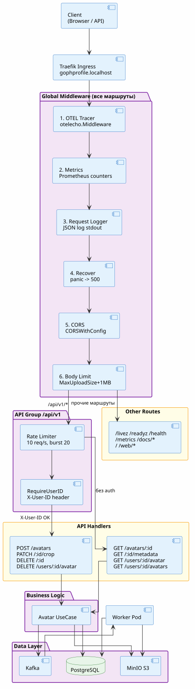
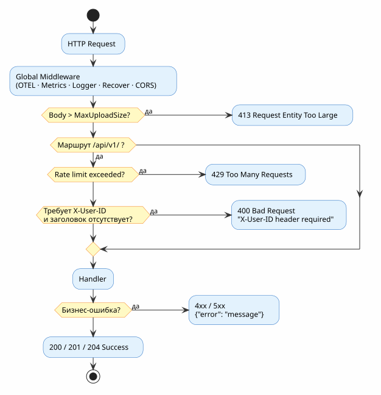

# API Архитектура и Request Flow

**Последнее обновление**: 16 сентября 2026 года

## Обзор

GophProfile REST API построен на базе Echo framework. Каждый запрос проходит через цепочку из 6 глобальных middleware перед достижением handler'а. Rate limiter применяется только к группе `/api/v1`.

---

## Request/Response Flow

> PlantUML-источник: [`docs/diagrams/src/request-flow.puml`](diagrams/src/request-flow.puml)
<p style="text-align:center">

</p>
---

## Middleware Chain (детально)

Регистрируется в `NewServer()` (`internal/transport/rest/server.go`):

### 1. OTEL Tracer

**Назначение**: Распределённая трассировка (OpenTelemetry)

```go
e.Use(otelecho.Middleware("gophprofile-server", otelecho.WithSkipper(func(c echo.Context) bool {
    path := c.Path()
    return path == "/health" || path == "/livez" || path == "/readyz" || path == "/metrics" || path == "/docs"
})))
```

**Что трассирует**: HTTP method, path, status, duration, errors.

**Skipped**: `/health`, `/livez`, `/readyz`, `/metrics`, `/docs` (снижение шума)

**Экспорт**: gRPC → OTEL Collector :4317 → Jaeger

**Пример в Jaeger**:
```
POST /api/v1/avatars — 125ms
├── database_query (45ms)
├── s3_upload (70ms)
└── kafka_publish (10ms)
```

---

### 2. Metrics Middleware

**Назначение**: Prometheus-метрики для каждого HTTP запроса

Вызывает `observability.BeginHTTP()` — фиксирует метод, путь, статус и duration через `prometheus/client_golang`.

**Метрики**:
- `http_requests_total{method, path, status}`
- `http_request_duration_seconds{method, path}`
- `http_requests_in_flight`

---

### 3. Request Logger

**Назначение**: Структурированное логирование каждого запроса

```go
// internal/transport/rest/middleware/logger.go
logger.Info(ctx, "http request",
    logging.String("method", c.Request().Method),
    logging.String("path", c.Path()),
    logging.Int("status", c.Response().Status),
    logging.Duration("duration", time.Since(started)),
)
```

**Формат**: JSON в stdout

**Пример**:
```json
{"level":"info","msg":"http request","method":"POST","path":"/api/v1/avatars","status":201,"duration":"125ms"}
```

---

### 4. Recover

**Назначение**: Перехват panic → HTTP 500

Оборачивает `echoMiddleware.Recover()`. Предотвращает падение всего процесса при панике в handler'е.

---

### 5. CORS

**Назначение**: Cross-Origin Resource Sharing

```go
// internal/transport/rest/middleware/cors.go
echoMiddleware.CORSWithConfig(echoMiddleware.CORSConfig{
    AllowOrigins: []string{"*"},
    AllowMethods: []string{"GET", "POST", "PATCH", "DELETE", "OPTIONS"},
    AllowHeaders: []string{"Origin", "Content-Type", "Accept", "X-User-ID"},
})
```

---

### 6. Body Limit 📦

**Назначение**: Ограничение размера тела запроса

```go
echoMiddleware.BodyLimit(strconv.FormatInt(cfg.MaxUploadSize+1024*1024, 10))
```

Лимит = `MaxUploadSize` из конфига + 1 MB на накладные расходы (default: 10MB + 1MB = 11MB).

---

### Rate Limiter (только /api/v1) ⏱️

Применяется через `api.Use(...)` — только к API-группе, не к `/health`, `/metrics`, `/docs` и web-роутам.

```go
echoMiddleware.RateLimiterWithConfig(echoMiddleware.RateLimiterConfig{
    Store: echoMiddleware.NewRateLimiterMemoryStoreWithConfig(echoMiddleware.RateLimiterMemoryStoreConfig{
        Rate:  rate.Limit(cfg.RateLimitPerSecond),
        Burst: cfg.RateLimitBurst,
    }),
})
```

**Конфиг** (из `values.yaml`):
```yaml
serverRateLimitPerSecond: 10   # 10 req/sec
serverRateLimitBurst: 20       # burst до 20 req
```

**Ответ при превышении** (429):
```json
{"error": "rate limit exceeded"}
```

---

### RequireUserID (per-route) 🔑

Не глобальный middleware — per-route функция-обёртка. Применяется только к эндпоинтам, требующим идентификации пользователя.

```go
// internal/transport/rest/middleware/auth.go
func RequireUserID(next echo.HandlerFunc) echo.HandlerFunc {
    return func(c echo.Context) error {
        userID := strings.TrimSpace(c.Request().Header.Get("X-User-ID"))
        if userID == "" {
            return echo.NewHTTPError(http.StatusBadRequest, "X-User-ID header required")
        }
        c.Set("gophprofile.user_id", userID)
        return next(c)
    }
}
```

> **Важно**: Авторизация основана на заголовке `X-User-ID`, **не на JWT**. Отсутствие заголовка → **400 Bad Request** (не 401).

---

## Endpoints

### 📤 API Endpoints (/api/v1)

Rate limiter применяется ко всем. `RequireUserID` — только к помеченным.

| Method | Path | Auth | Handler | Описание |
|--------|------|:----:|---------|---------|
| POST | `/api/v1/avatars` | ✅ | `createAvatar` | Загрузить аватар |
| GET | `/api/v1/avatars/:id` | — | `downloadAvatar` | Скачать файл аватара |
| GET | `/api/v1/avatars/:id/metadata` | — | `metadata` | Получить метаданные |
| PATCH | `/api/v1/avatars/:id/crop` | ✅ | `updateAvatarCrop` | Обрезать аватар |
| DELETE | `/api/v1/avatars/:id` | ✅ | `deleteAvatar` | Удалить аватар |
| GET | `/api/v1/users/:user_id/avatar` | — | `downloadUserAvatar` | Текущий аватар пользователя |
| GET | `/api/v1/users/:user_id/avatars` | — | `listUserAvatars` | Список аватаров пользователя |
| DELETE | `/api/v1/users/:user_id/avatar` | ✅ | `deleteUserAvatar` | Удалить текущий аватар |

### 🌐 Web UI Endpoints

Глобальный middleware применяется, rate limiter и auth — нет.

| Method | Path | Описание |
|--------|------|---------|
| GET | `/` | SPA root → `web/index.html` |
| GET | `/web/upload` | Страница загрузки |
| POST | `/web/upload` | Загрузка через форму (X-User-ID required) |
| GET | `/web/gallery/:user_id` | Галерея аватаров |

### 🏥 Health Endpoints

| Method | Path | Назначение | K8s Probe |
|--------|------|-----------|-----------|
| GET | `/livez` | Процесс жив (не проверяет deps) | Liveness + Startup |
| GET | `/readyz` | Готов к трафику (проверяет DB/S3/Kafka) | Readiness |
| GET | `/health` | То же что readyz, для внешнего мониторинга | — |

**Probes в Helm chart**:
```yaml
startupProbe:
  httpGet: {path: /livez, port: 8080}
  initialDelaySeconds: 2
  periodSeconds: 5
  failureThreshold: 30   # 150s max startup time

livenessProbe:
  httpGet: {path: /livez, port: 8080}
  initialDelaySeconds: 5
  periodSeconds: 10

readinessProbe:
  httpGet: {path: /readyz, port: 8080}
  initialDelaySeconds: 5
  periodSeconds: 10
```

### Metrics & Docs

| Method | Path | Описание |
|--------|------|---------|
| GET | `/metrics` | Prometheus text format |
| GET | `/docs` | Redirect → `/docs/index.html` |
| GET | `/docs/*` | Swagger UI (echoSwagger) |

---

## Request/Response Examples

### 1. CreateAvatar

**Request**:
```http
POST /api/v1/avatars HTTP/1.1
Content-Type: multipart/form-data; boundary=...
X-User-ID: 550e8400-e29b-41d4-a716-446655440000

[multipart form data with file]
```

**Response** (201 Created):
```json
{
  "id": "123e4567-e89b-12d3-a456-426614174000",
  "user_id": "550e8400-e29b-41d4-a716-446655440000",
  "file_name": "profile.jpg",
  "size": 102400,
  "mime_type": "image/jpeg",
  "created_at": "2026-09-16T12:34:56Z"
}
```

**Middleware sequence**:
```
OTEL → Metrics → Logger → Recover → CORS → BodyLimit → [RateLimit /api/v1] → [RequireUserID per-route] → Handler
```

---

### 2. GetAvatar (без X-User-ID)

**Request**:
```http
GET /api/v1/avatars/123e4567-e89b-12d3-a456-426614174000 HTTP/1.1
```

**Response** (200 OK):
```
Content-Type: image/jpeg
Content-Length: 102400

[binary image data]
```

**Middleware sequence**:
```
OTEL → Metrics → Logger → Recover → CORS → BodyLimit → [RateLimit /api/v1] → Handler
```

---

### 3. Отсутствует X-User-ID

**Response** (400 Bad Request):
```json
{"error": "X-User-ID header required"}
```

### 4. Rate Limit Exceeded

**Response** (429 Too Many Requests):
```json
{"error": "rate limit exceeded"}
```

---

## Error Handling

> PlantUML-источник: [`docs/diagrams/src/error-flow.puml`](diagrams/src/error-flow.puml)
<p style="text-align:center">

</p>
### HTTPErrorHandler

Глобальный обработчик ошибок в `NewServer()` нормализует все ошибки в единый формат:

```go
e.HTTPErrorHandler = func(err error, c echo.Context) {
    var httpErr *echo.HTTPError
    if errors.As(err, &httpErr) {
        _ = c.JSON(httpErr.Code, map[string]any{"error": httpErr.Message})
        return
    }
    _ = respondError(c, err)
}
```

Все ошибки → `{"error": "message"}`.

---

## Performance

### Middleware Overhead (оценка)

| Middleware | Overhead | Примечание |
|-----------|:--------:|-----------|
| OTEL | ~1–5ms | Async export, skips health/metrics/docs |
| Metrics | ~0.1ms | In-memory Prometheus counters |
| Logger | ~0.5ms | Structured log в stdout |
| Recover | ~0ms | Только при panic |
| CORS | ~0.1ms | Проверка заголовков |
| BodyLimit | ~0ms | Проверка Content-Length |
| RateLimit | ~0.05ms | In-memory token bucket |
| RequireUserID | ~0.05ms | Чтение одного заголовка |

**Итого**: ~2–7ms baseline на API запрос

---

## Observability

### Logs

```json
{"level":"info","msg":"http request","method":"POST","path":"/api/v1/avatars","status":201,"duration":"125ms"}
```

Логи → stdout → OTEL Collector → Loki

### Traces

Spans → OTEL Collector → Jaeger. Sampling: `otelTraceSampleRatio` (dev: 10%, prod: 1%).

### Metrics

```
http_requests_total{method="POST",path="/api/v1/avatars",status="201"} 1542
http_request_duration_seconds_bucket{le="0.1"} 1200
```

---

## References

- [Echo Framework](https://echo.labstack.com/)
- [OpenTelemetry Go](https://opentelemetry.io/docs/instrumentation/go/)
- [Prometheus Go client](https://github.com/prometheus/client_golang)
- [otelecho middleware](https://pkg.go.dev/go.opentelemetry.io/contrib/instrumentation/github.com/labstack/echo/otelecho)

---

## История изменений

| Дата | Версия | Изменение |
|------|--------|-----------|
| 2026-09-16 | 1.1    | Mermaid заменены на PlantUML SVG диаграммы |
| 2026-09-16 | 1.0    | Начальная версия |
