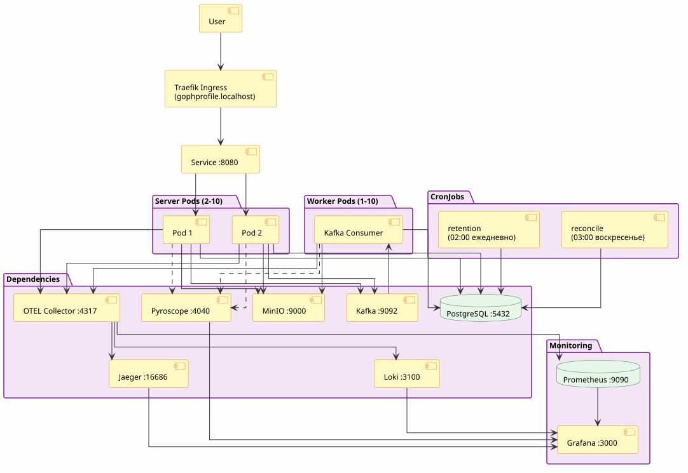
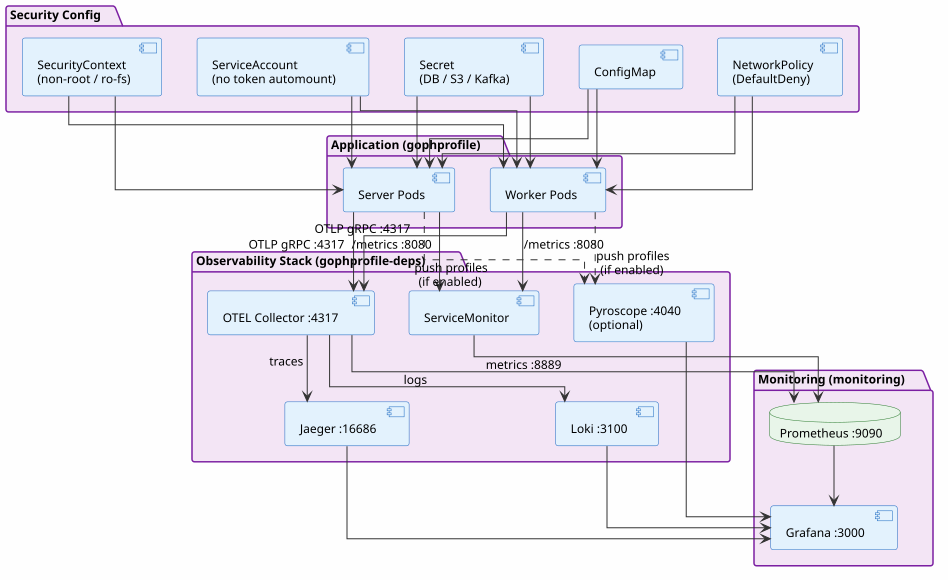

# Архитектура GophProfile в Kubernetes

**Дата обновления**: 16 сентября 2026 г.  
**Среда**: Development & Production (multi-namespace)

## Обзор

GophProfile развёрнут на Kubernetes с многопространственной архитектурой. Основные компоненты приложения живут в namespace `gophprofile`, все зависимости — в `gophprofile-deps`, мониторинг — в `monitoring`. Диаграммы описывают топологию кластера и стек observability/security.
`vault`, `external-secrets`, `harbor` инфраструктурные компоненты деплоя
---

## Диаграмма 1: Основная топология кластера

> PlantUML-источник: [`docs/diagrams/src/topology.puml`](diagrams/src/topology.puml)  
> CI рендерит SVG автоматически при изменении `.puml` файлов.
<p style="text-align:center">

</p>
**Компоненты:**

| Компонент | Namespace | Описание |
|-----------|-----------|---------|
| Traefik Ingress | `kube-system` | Входной контроллер, маршрутизирует `gophprofile.localhost` |
| Service :8080 | `gophprofile` | ClusterIP, балансирует трафик между Server Pods |
| Server Pods (2–10) | `gophprofile` | HTTP API, обработка запросов, HPA по CPU/Memory |
| Worker Pod (1–10) | `gophprofile` | Kafka consumer, обработка событий, HPA по CPU/Memory |
| CronJob retention | `gophprofile` | Ежедневно 02:00 — очистка старых аватаров |
| CronJob reconcile | `gophprofile` | Воскресенье 03:00 — верификация orphan объектов |
| PostgreSQL :5432 | `gophprofile-deps` | Метаданные аватаров |
| MinIO :9000 | `gophprofile-deps` | Object storage, хранение файлов аватаров |
| Kafka :9092 | `gophprofile-deps` | Message broker, топик `avatar-events` |
| OTEL Collector :4317 | `gophprofile-deps` | Агрегатор телеметрии (traces + metrics + logs) |
| Jaeger :16686 | `gophprofile-deps` | Distributed tracing UI |
| Loki :3100 | `gophprofile-deps` | Хранилище логов (OTLP HTTP input) |
| Pyroscope :4040 | `gophprofile-deps` | Continuous profiling (опционально) |
| Prometheus :9090 | `monitoring` | Хранилище метрик (kube-prometheus-stack) |
| Grafana :3000 | `monitoring` | Дашборды: метрики, трейсы, логи, профили |

---

## Диаграмма 2: Observability & Security

> PlantUML-источник: [`docs/diagrams/src/observability.puml`](diagrams/src/observability.puml)

<p style="text-align:center">

</p>

### Observability — пайплайны

```
App pods  ──OTLP gRPC :4317──▶  OTEL Collector  ──▶  Jaeger   (traces)
                                                  ──▶  Loki     (logs)
                                                  ──▶  Prometheus :8889 (metrics)
App pods  ──/metrics :8080──▶  ServiceMonitor  ──▶  Prometheus
App pods  ──push (optional)──▶  Pyroscope      ──▶  Grafana   (profiles)

Grafana: datasources = Prometheus + Jaeger + Loki + Pyroscope
```

**Компоненты observability:**

- **OTEL Collector** (`otel/opentelemetry-collector-contrib:0.151.0`) — принимает OTLP gRPC :4317 и HTTP :4318, раскидывает по трём пайплайнам
- **Jaeger** (`cr.jaegertracing.io/jaegertracing/jaeger:2.20.0`) — получает трейсы от OTEL Collector через OTLP gRPC
- **Loki** — получает логи от OTEL Collector через OTLP HTTP :3100
- **Prometheus** — метрики из двух источников: ServiceMonitor (scrape `/metrics`) + OTEL Collector (`/metrics` :8889)
- **Grafana** — все четыре datasource; Pyroscope dashboard устанавливается автоматически
- **Pyroscope** (`grafana/pyroscope:1.18.0`) — включается через `PYROSCOPE_ENABLED=true`; собирает CPU, alloc, inuse objects/space, goroutines

---

## Сетевая топология и Service Discovery

| Сервис | DNS Name | Порт | Namespace |
|--------|----------|------|-----------|
| gophprofile (API) | `gophprofile.gophprofile.svc.cluster.local` | 8080 | `gophprofile` |
| PostgreSQL | `postgres.gophprofile-deps.svc.cluster.local` | 5432 | `gophprofile-deps` |
| MinIO | `minio.gophprofile-deps.svc.cluster.local` | 9000 | `gophprofile-deps` |
| Kafka | `kafka.gophprofile-deps.svc.cluster.local` | 9092 | `gophprofile-deps` |
| OTEL Collector | `otel-collector.gophprofile-deps.svc.cluster.local` | 4317 | `gophprofile-deps` |
| Jaeger UI | `jaeger.gophprofile-deps.svc.cluster.local` | 16686 | `gophprofile-deps` |
| Loki | `loki.gophprofile-deps.svc.cluster.local` | 3100 | `gophprofile-deps` |
| Pyroscope | `pyroscope.gophprofile-deps.svc.cluster.local` | 4040 | `gophprofile-deps` |
| Prometheus | `prometheus.monitoring.svc.cluster.local` | 9090 | `monitoring` |
| Grafana | `grafana.monitoring.svc.cluster.local` | 3000 | `monitoring` |

---

## Спецификации ресурсов

### Server Deployment

| Параметр | Значение |
|----------|----------|
| Replicas (initial) | 2 |
| HPA Min / Max | 2 / 10 |
| CPU Request / Limit | 100m / 500m |
| Memory Request / Limit | 128Mi / 512Mi |
| Scale trigger | CPU > 70% или Memory > 80% |
| Termination grace | 30s |
| Rolling update | maxUnavailable: 0, maxSurge: 1 |
| preStop hook | sleep 5s (graceful drain) |

### Worker Deployment

| Параметр | Значение |
|----------|----------|
| Replicas (initial) | 1 |
| HPA Min / Max | 1 / 10 |
| CPU Request / Limit | 100m / 500m |
| Memory Request / Limit | 128Mi / 512Mi |
| Scale trigger | CPU > 70% или Memory > 80% |
| Termination grace | 30s |

### CronJobs

| Параметр | Значение |
|----------|----------|
| retention schedule | `0 2 * * *` (ежедневно 02:00) |
| reconcile schedule | `0 3 * * 0` (воскресенье 03:00) |
| Concurrency policy | Forbid |
| Max runtime | 1800s (30 мин) |
| Backoff limit | 2 |
| Keep successful / failed | 3 / 3 |

### CronJob Resources

| Компонент | CPU Request/Limit | Memory Request/Limit |
|-----------|------------------|---------------------|
| cronjob | 50m / 250m | 64Mi / 256Mi |
| migrate | 50m / 250m | 64Mi / 256Mi |

---

## Проверки здоровья (Health Probes)

Все значения берутся из `values.yaml` (`probes.*`):

### Startup Probe
- **Endpoint**: `GET /livez`
- **Initial delay**: 2s, **Interval**: 5s, **Failure threshold**: 30 (= 150s max startup)
- Даёт приложению время на инициализацию до начала liveness checks

### Liveness Probe
- **Endpoint**: `GET /livez`
- **Initial delay**: 5s, **Interval**: 10s, **Timeout**: 3s, **Failure threshold**: 3
- Проверяет только что процесс жив, без внешних зависимостей — перезапускает pod при зависании

### Readiness Probe
- **Endpoint**: `GET /readyz`
- **Initial delay**: 5s, **Interval**: 10s, **Timeout**: 3s, **Failure threshold**: 3
- Проверяет DB, MinIO, Kafka — исключает pod из Service endpoints при недоступности deps

---

## Конфигурация

### ConfigMap (несекретные параметры)

```yaml
env: prod
serverPort: "8080"
serverRateLimitPerSecond: "10"
serverRateLimitBurst: "20"
serverMaxUploadSize: "10485760"   # 10 MB
logLevel: info
logFormat: json
otelEnabled: "true"
otelInsecure: "true"
otelTraceSampleRatio: "0.1"       # dev: 10%, prod: 0.01 (1%)
pyroscopeEnabled: "false"         # включается через task app-pyroscope-enable
```

### Secret (чувствительные данные)

| Ключ | Описание |
|------|---------|
| `DATABASE_URL` | PostgreSQL DSN |
| `S3_ENDPOINT` | MinIO endpoint |
| `S3_ACCESS_KEY_ID` | MinIO access key |
| `S3_SECRET_ACCESS_KEY` | MinIO secret key |
| `KAFKA_BROKERS` | Kafka brokers list |
| `OTEL_EXPORTER_OTLP_ENDPOINT` | OTEL Collector адрес |
| `PYROSCOPE_SERVER_ADDRESS` | Pyroscope endpoint |
| `PYROSCOPE_AUTH_TOKEN` | Pyroscope auth token |

По умолчанию секреты хранятся в K8s Secret. В production — через External Secrets Operator + HashiCorp Vault (`externalSecret.enabled: true`).

### По окружениям

| Параметр | dev | prod |
|----------|-----|------|
| `otelTraceSampleRatio` | 0.1 (10%) | 0.01 (1%) |
| `pyroscopeEnabled` | false (включается вручную) | false |
| `externalSecret.enabled` | false | true |
| `logLevel` | info | info |

---

## Безопасность

### SecurityContext (Pods)

```yaml
podSecurityContext:
  runAsNonRoot: true
  runAsUser: 1000
  runAsGroup: 1000
  fsGroup: 1000
  seccompProfile:
    type: RuntimeDefault

containerSecurityContext:
  allowPrivilegeEscalation: false
  readOnlyRootFilesystem: true
  capabilities:
    drop: [ALL]
```

### ServiceAccount

```yaml
automountServiceAccountToken: false  # токен не монтируется
```

### NetworkPolicy

Тип `DefaultDeny` + явные разрешения:

```
Разрешено входящее:
  Ingress Controller   → server :8080
  Prometheus           → server/worker :8080 (/metrics)

Разрешено исходящее:
  server/worker/cron   → PostgreSQL :5432
  server/worker        → MinIO :9000
  server/worker        → Kafka :9092
  server/worker        → OTEL Collector :4317 (gRPC) / :4318 (HTTP)
  server/worker        → Pyroscope :4040  (если enabled)

Запрещено:
  Pod-to-pod (не из списка выше)
  Egress в интернет
```

---

## Поток данных: Загрузка аватара

```
1. Client  ──POST /api/v1/avatars + X-User-ID──▶  Traefik Ingress
2. Ingress ──▶  Service :8080 ──▶  Server Pod
3. Server Pod:
     ├─ Валидация (BodyLimit, RequireUserID)
     ├─ Загрузка файла в MinIO :9000
     ├─ Запись метаданных в PostgreSQL :5432
     ├─ Публикация события в Kafka :9092
     └─ Return 201 Created
4. Worker Pod (читает Kafka):
     ├─ Получение оригинала из MinIO
     ├─ Генерация миниатюр
     ├─ Сохранение миниатюр в MinIO
     └─ Обновление статуса в PostgreSQL
5. OTEL Collector (async):
     ├─ Трейсы → Jaeger
     ├─ Логи → Loki
     └─ Метрики → Prometheus
6. Prometheus (каждые 30s): scrape /metrics со всех pods
7. Grafana: визуализация метрик, трейсов, логов
```

---

## Troubleshooting

### Pod stuck в Pending
```bash
kubectl describe pod <pod> -n gophprofile
kubectl top nodes
```

### Database connection errors
```bash
kubectl exec -it <server-pod> -n gophprofile -- \
  nc -zv postgres.gophprofile-deps 5432
kubectl logs -l app.kubernetes.io/component=migrate -n gophprofile
```

### Метрики не в Prometheus
```bash
kubectl get servicemonitor -n gophprofile
kubectl get servicemonitor -n gophprofile-deps   # OTEL collector monitor
kubectl logs -l app=prometheus -n monitoring
```

### Трейсы не в Jaeger
```bash
kubectl logs -l app.kubernetes.io/name=otel-collector -n gophprofile-deps
# Проверить что OTEL_ENDPOINT настроен правильно
kubectl get configmap -n gophprofile -o yaml | grep otelEndpoint
```

### High latency / перегрузка
```bash
kubectl top pods -n gophprofile
kubectl get hpa -n gophprofile
kubectl describe hpa -n gophprofile
```

### Включить профилирование (Pyroscope)
```bash
task app-pyroscope-enable   # устанавливает PYROSCOPE_ENABLED=true + адрес сервера
task app-pyroscope-disable  # отключает
```

---

## Шаги развёртывания

```bash
# 1. Создать кластер
task k3d-up

# 2. Установить Harbor (container registry)
task harbor-up && task harbor-configure

# 3. Собрать и запушить образы
task build-push

# 4. Установить зависимости + observability (helmfile)
task helmfile-infra-sync-dev

# 5. Задеплоить приложение
task helmfile-app-sync-dev

# 6. Проверить здоровье
kubectl get pods -n gophprofile
curl http://gophprofile.localhost/livez   # {"status":"ok"}
curl http://gophprofile.localhost/readyz  # {"status":"ok",...}
```

---

## Ссылки

- [Kubernetes Docs](https://kubernetes.io/docs/)
- [Helm Chart Templates](https://helm.sh/docs/chart_template_guide/)
- [NetworkPolicy](https://kubernetes.io/docs/concepts/services-networking/network-policies/)
- [Prometheus ServiceMonitor](https://prometheus-operator.dev/docs/operator/api/#servicemonitor)
- [OpenTelemetry Collector](https://opentelemetry.io/docs/collector/)
- [PlantUML Guide](https://plantuml.com/guide)
- [Pyroscope Go SDK](https://grafana.com/docs/pyroscope/latest/configure-client/language-sdks/go_push/)

---

**Последнее обновление**: 16 сентября 2026 г.  
