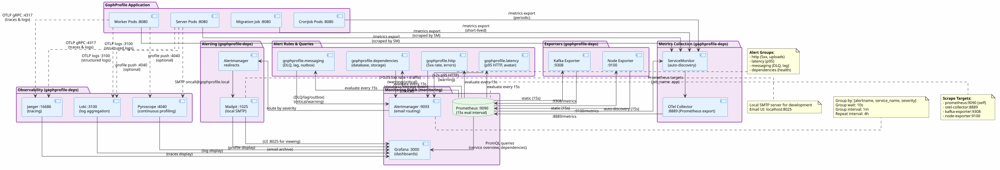

# Мониторинг и алерты GophProfile

## Обзор

GophProfile использует стек Prometheus + Grafana + Alertmanager для мониторинга health и performance приложения. Все метрики собираются через OpenTelemetry Collector и экспортируются в Prometheus. Алерты направляются в Alertmanager и доставляются по почте.

## Архитектура



PlantUML исходник: [docs/diagrams/src/monitoring-stack.puml](diagrams/src/monitoring-stack.puml)

## Метрики

### Источники

**GophProfile server/worker/cronjob:**
- HTTP запросы: `http_server_request_count_total`, `http_server_request_duration_seconds`
- Обработка аватаров: `avatars_uploads_total`, `avatars_processing_duration_seconds`
- Database операции: отслеживаются через OTEL
- S3/MinIO операции: отслеживаются через OTEL (retry logic, latency)
- Messaging: `messaging_dlq_total`, `messaging_retry_total`
- Зависимости: `dependency_availability`

**Infrastructure:**
- OTel Collector: `otel_collector_*` (memory, CPU, runtime metrics)
- Node Exporter: `node_*` (CPU, memory, disk, network)
- Kafka Exporter: `kafka_consumergroup_lag`, `kafka_brokers_online`

### Скрейп-конфигурация

Prometheus собирает метрики с интервалом **15 секунд** по следующим targets:

| Job | Target | Port | Интервал |
|-----|--------|------|----------|
| prometheus | localhost:9090 | 9090 | 15s |
| otel-collector | otel-collector:8889 | 8889 | 15s |
| kafka-exporter | kafka-exporter:9308 | 9308 | 15s |
| node-exporter | node-exporter:9100 | 9100 | 15s |

Kubernetes-окружение использует **ServiceMonitor** CRD для автоматического обнаружения сервисов с меткой `prometheus: enabled`.

## Правила алертов

Правила хранятся в `deployments/observability/rules/gophprofile-alerts.yaml`. Prometheus вычисляет их каждые **15 секунд**.

### HTTP группа

#### GophProfileHighHTTP5xxRate
- **Триггер**: >5% ответов со статусом 5xx при трафике >0.1 req/s
- **Длительность**: 10 минут
- **Severity**: warning
- **Описание**: Высокая доля HTTP-ошибок сервера. Проверьте логи и метрики latency.

#### GophProfileHighAvatarUploadErrorRate
- **Триггер**: >10% ошибок при загрузке аватаров при трафике >1 загрузка в минуту
- **Длительность**: 10 минут
- **Severity**: warning
- **Описание**: Много ошибок при загрузке изображений. Проверьте S3/MinIO и валидацию входных данных.

#### GophProfileHealthEndpointErrors
- **Триггер**: любые HTTP 5xx на `/health`
- **Длительность**: 5 минут
- **Severity**: critical
- **Описание**: Health check возвращает ошибку. Проверьте database, storage и broker соединения.

### Latency группа

#### GophProfileHighHTTPP95Latency
- **Триггер**: p95 HTTP latency >2 сек при трафике >0.1 req/s
- **Длительность**: 10 минут
- **Severity**: warning
- **Описание**: Медленные HTTP-ответы. Проверьте database query performance, S3 latency или network issues.

#### GophProfileHighAvatarProcessingP95Latency
- **Триггер**: p95 обработки аватара >5 сек при трафике >1 обработка в минуту
- **Длительность**: 10 минут
- **Severity**: warning
- **Описание**: Обработка изображений занимает слишком долго. Это может быть нормой при работе с большими файлами.

### Messaging группа

#### GophProfileMessagingDLQMessages
- **Триггер**: любые сообщения в DLQ за 10 минут
- **Длительность**: 1 минута
- **Severity**: critical
- **Описание**: Сообщение не обработано после всех retry и отправлено в Dead Letter Queue. Требует немедленного расследования.

#### GophProfileSustainedMessagingRetries
- **Триггер**: >0.1 retry/сек на протяжении 10 минут
- **Длительность**: 10 минут
- **Severity**: warning
- **Описание**: Много retry при обработке сообщений. Это может указывать на временные проблемы с broker или зависимостями.

#### GophProfileKafkaConsumerLag
- **Триггер**: consumer lag >100 сообщений в consumer group `gophprofile-workers`
- **Длительность**: 10 минут
- **Severity**: warning
- **Описание**: Worker потребляет сообщения медленнее, чем они поступают. Может потребоваться масштабирование worker'ов.

#### GophProfileOutboxBacklog
- **Триггер**: >100 ожидающих записей в transactional outbox
- **Длительность**: 15 минут
- **Severity**: warning
- **Описание**: Outbox не успевает отправить события. Проверьте database и broker соединения.

### Dependencies группа

#### GophProfileDependencyUnavailable
- **Триггер**: health probe возвращает 0 для database, storage или broker
- **Длительность**: 2 минуты
- **Severity**: critical
- **Описание**: Критическая зависимость недоступна. Приложение не сможет обрабатывать запросы.

#### GophProfileOTelCollectorScrapeDown
- **Триггер**: OTel Collector не отвечает на Prometheus scrape
- **Длительность**: 5 минут
- **Severity**: critical
- **Описание**: Метрики приложения недоступны. Prometheus не может собирать данные.

#### GophProfilePrometheusScrapeDown
- **Триггер**: Prometheus не может скрейпить собственный endpoint
- **Длительность**: 5 минут
- **Severity**: critical
- **Описание**: Prometheus некорректно сконфигурирован или не здоров.

#### GophProfileNodeExporterScrapeDown
- **Триггер**: Node Exporter не отвечает
- **Длительность**: 10 минут
- **Severity**: warning
- **Описание**: Host metrics недоступны. Это некритично если сам приложение работает.

## Alertmanager

### Конфигурация

**Файл:** `deployments/observability/alertmanager.yaml`

**Параметры:**
- **Global resolve timeout**: 1 минута (время, через которое алерт считается resolved)
- **SMTP host**: mailpit:1025 (локальный SMTP сервер для разработки)
- **From**: alertmanager@gophprofile.local

### Маршрутизация

```
Root route:
├─ receiver: local-email
├─ group_by: [alertname, service_name, severity]
├─ group_wait: 10s        (ждём 10 сек перед отправкой первого батча)
├─ group_interval: 1m     (отправляем обновления каждую минуту)
└─ repeat_interval: 4h    (повторяем разрешённый алерт каждые 4 часа)
```

### Email доставка

**To**: oncall@gophprofile.local
**Опции:**
- `send_resolved: true` — отправляем email и при триггере алерта, и при его разрешении
- `require_tls: false` — для локальной разработки TLS не требуется

## Дашборды Grafana

### Доступные дашборды

1. **GophProfile / Обзор сервиса** — комплексный дашборд с HTTP RED-метриками, статусом зависимостей, messaging, обработкой аватаров, использованием ресурсов и связанными логами
2. **GophProfile / Continuous Profiling** — CPU, memory и goroutine profiles из Pyroscope

### Как открыть

```bash
# Локальное развертывание (Docker Compose)
open http://localhost:3000

# Kubernetes (с port-forward)
kubectl port-forward svc/grafana 3000:3000 -n gophprofile-deps
open http://localhost:3000
```

**Default credentials:**
- Username: `admin`
- Password: настраивается через Helm values или `grafana-admin-password` secret

## Jaeger (Distributed Tracing)

### Интеграция

GophProfile отправляет OpenTelemetry traces в Jaeger. Все HTTP-запросы, database операции и async tasks автоматически трейсятся и коррелируют по `trace_id`.

### Доступ

```bash
# Локально
open http://localhost:16686

# Kubernetes
kubectl port-forward svc/jaeger 16686:16686 -n gophprofile-deps
open http://localhost:16686
```

### Основные сценарии отладки

**Найти медленный запрос:**
1. Откройте Jaeger → Search
2. Выберите service `gophprofile-server`
3. Установите min duration: `2s`
4. Нажмите Find Traces

**Отследить обработку аватара (с retry):**
1. Возьмите `trace_id` из логов: `trace_id=abc123def456`
2. Search → Trace ID → введите `abc123def456`
3. Посмотрите цепь: HTTP → Upload → S3 operations → Database commit

## Loki (Log Aggregation)

### Интеграция

Структурированные логи отправляются через OTLP в Loki. Каждый лог помечен `trace_id` для корреляции с traces.

### Доступ

```bash
# Через Grafana
open http://localhost:3000
# Выберите data source "Loki", откройте Logs
```

### Запросы

**Ошибки за последний час:**
```logql
{job="gophprofile-server"} | level="error"
```

**Логи конкретной trace:**
```logql
{job="gophprofile-server"} | trace_id="abc123def456"
```

**Retry patterns:**
```logql
{job="gophprofile-server"} | "retry attempt" | level="warn"
```

## Pyroscope (Continuous Profiling)

### Интеграция

GophProfile отправляет CPU и memory profiles в Pyroscope для анализа performance bottleneck'ов.

### Доступ

```bash
# Локально
open http://localhost:4040

# Kubernetes
kubectl port-forward svc/pyroscope 4040:4040 -n gophprofile-deps
open http://localhost:4040
```

### Сценарии анализа

**Высокий CPU utilization:**
1. Откройте Pyroscope → Timeline
2. Выберите service `gophprofile-server`
3. Посмотрите profile, отсортируйте по CPU time
4. Найдите "hot" функции

## Локальное развертывание

### Docker Compose

```bash
# Весь стек (app + observability)
task docker-up

# Только observability
task observability-up
```

### Kubernetes

```bash
# Поднять кластер и observability
task k3d-up
task observability-up  # включает Prometheus, Grafana, Jaeger, Loki, Pyroscope

# Port forwarding для локального доступа
kubectl port-forward -n gophprofile-deps svc/prometheus 9090:9090 &
kubectl port-forward -n gophprofile-deps svc/grafana 3000:3000 &
kubectl port-forward -n gophprofile-deps svc/jaeger 16686:16686 &
```

## Troubleshooting

### Метрики не собираются

**Признак:** Grafana dashboard пустой, Prometheus не видит targets.

**Решение:**
1. Проверьте, что сервис слушает на `:8080/metrics`:
   ```bash
   curl http://localhost:8080/metrics
   ```
2. Проверьте конфиг Prometheus:
   ```bash
   curl http://localhost:9090/api/v1/targets
   ```
3. Проверьте OTel Collector экспорт:
   ```bash
   docker logs otel-collector
   ```

### Алерты не отправляются

**Признак:** Алерты срабатывают в Prometheus, но email не приходит.

**Решение:**
1. Проверьте Alertmanager status:
   ```bash
   curl http://localhost:9093/#/status
   ```
2. Проверьте SMTP соединение:
   ```bash
   docker logs mailpit
   ```
3. Проверьте конфиг routes в alertmanager.yaml

### Высокая latency на /metrics

**Признак:** Prometheus scrape timeouts, OTel Collector медленный.

**Решение:**
1. Проверьте, сколько метрик экспортируется:
   ```bash
   curl http://localhost:8080/metrics | wc -l
   ```
2. Если >10k метрик, это может быть issue с cardinality (множество label combinations).
3. Пересмотрите label strategy — убедитесь, что не используются high-cardinality values (user_id, request_id).

## Best Practices

1. **Low-cardinality labels**: Использование `user_id` в labels приводит к explosion метрик. Используйте только fixed set labels: `service_name`, `deployment_environment_name`, `http_method`, и т.п.

2. **Чувствительные данные**: Никогда не включайте credentials, API keys, passwords в метрики или tags.

3. **Alert severity**: 
   - `critical` — требует немедленного действия (зависимость недоступна)
   - `warning` — требует внимания, но не срочно (высокая latency, ошибки)

4. **Repeat interval**: Установите достаточно большой repeat_interval для warning алертов, чтобы не спамить oncall.

5. **Context в alerts**: Всегда включайте достаточно контекста в `annotations` для быстрого диагноза.

6. **Проверка alert rules**: Перед deploy проверяйте синтаксис и тесты через promtool:
   ```bash
   # Проверка синтаксиса
   task check-alerts
   
   # Запуск unit-тестов
   task test-alerts
   ```
   
   Unit-тесты находятся в `deployments/observability/rules/gophprofile-alerts.test.yml` и автоматически выполняются в CI/CD.

---

**Дата создания:** 2026-09-17
